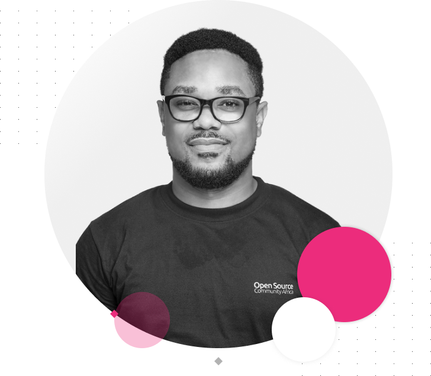

# Benson Imoh's Personal Website

A modern, responsive personal website and blog built with Next.js, React, and Tailwind CSS.



## 🚀 Features

- **Responsive Design**: Optimized for both desktop and mobile devices
- **Blog Platform**: MDX-powered blog with reading time estimation
- **SEO Optimized**: Built-in SEO configuration with next-seo
- **Modern UI**: Clean, professional interface with Tailwind CSS
- **Comprehensive Testing**: Jest and React Testing Library setup
- **TypeScript**: Type-safe codebase

## 🛠️ Technologies

- **Framework**: [Next.js 15](https://nextjs.org/)
- **Language**: [TypeScript](https://www.typescriptlang.org/)
- **Styling**: [Tailwind CSS](https://tailwindcss.com/)
- **Testing**: [Bun Test](https://bun.sh/docs/cli/test) & [React Testing Library](https://testing-library.com/docs/react-testing-library/intro/)
- **Content**: [MDX](https://mdxjs.com/) for blog posts
- **Icons**: [React Icons](https://react-icons.github.io/react-icons/)
- **UI Components**: Custom React components

## 📋 Prerequisites

- [Bun](https://bun.sh/) 1.0.0 or higher

## 🔧 Installation

1. Clone the repository
   ```bash
   git clone https://github.com/stbensonimoh/official-website.git
   cd official-website
   ```

2. Install dependencies
   ```bash
   bun install
   ```

3. Start the development server
   ```bash
   bun run dev
   ```

4. Open [http://localhost:3000](http://localhost:3000) in your browser

## 📝 Available Scripts

- `bun run dev` - Start the development server
- `bun run build` - Build the application for production
- `bun run start` - Start the production server
- `bun run lint` - Run ESLint to check for code issues
- `bun run test` - Run Bun tests
- `bun run test:watch` - Run tests in watch mode
- `bun run test:coverage` - Generate test coverage report

## 📁 Project Structure

```
├── .github/               # GitHub-specific files
│   ├── ISSUE_TEMPLATE/    # Issue templates
│   ├── CONTRIBUTING.md    # Contribution guidelines
│   ├── SECURITY.md        # Security policy
│   ├── commit-template.txt # Git commit message template
│   └── pull_request_template.md # PR template
├── blog/                  # Blog posts in MDX format
├── public/                # Static assets
│   ├── images/            # Image files
│   └── logo.svg           # Website logo
├── src/
│   ├── app/               # Next.js App Router
│   │   ├── components/    # React components
│   │   ├── [slug]/        # Dynamic blog post routes
│   │   ├── about/         # About page
│   │   ├── blog/          # Blog listing page
│   │   ├── contact/       # Contact page
│   │   └── page.tsx       # Homepage
│   ├── lib/               # Utility functions
│   └── test-utils.tsx     # Testing utilities
├── siteMetadata.ts        # Website metadata
├── tailwind.config.ts     # Tailwind CSS configuration
├── next.config.mjs        # Next.js configuration
├── jest.config.js         # Jest configuration
└── tsconfig.json          # TypeScript configuration
```

## 🧪 Testing

The project uses Bun's built-in test runner and React Testing Library for testing. Run tests with:

```bash
bun run test
```

For test coverage:

```bash
bun run test:coverage
```

## 👥 Contributing

Contributions are welcome! Please check out my [contribution guidelines](.github/CONTRIBUTING.md) before getting started. This project includes:

- Issue templates for:
  - Bug reports
  - Feature requests
  - Documentation updates
  - Performance issues
  - Security vulnerabilities
- Pull request template
- Git commit message template (enable with `git config --local commit.template .github/commit-template.txt`)

## 🔒 Security

If you discover any security-related issues, please read my [security policy](.github/SECURITY.md) for information on how to report them.

## 🌐 Deployment

The site is optimized for deployment on [Vercel](https://vercel.com), but can be deployed to any static site hosting service.

## 👤 About the Author

Benson Imoh,ST is a Software Engineer, DevOps Enthusiast, and Open Source Software Advocate passionate about blending engineering and design to creatively and efficiently solve problems.

## 📄 License

This project is licensed under the MIT License - see the LICENSE file for details.

---

Built with ❤️ by [Benson Imoh](https://stbensonimoh.com)
