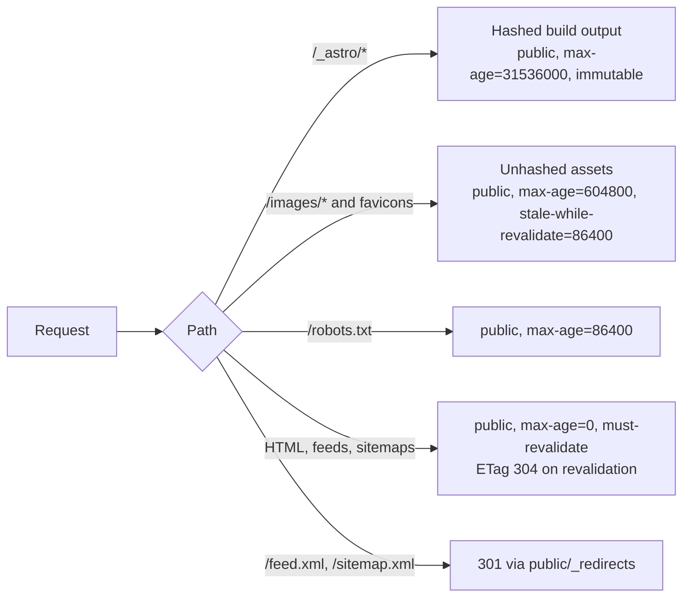

# ADR 0001: Performance and caching decisions

**Status:** Accepted
**Date:** 2026-10-10
**Epic:** [#172 Page performance overhaul](https://github.com/stbensonimoh/official-website/issues/172)
**Issue:** [#186 Add an ADR and commit the performance audit](https://github.com/stbensonimoh/official-website/issues/186)
**Audit:** [`docs/audits/2026-09-25-performance.md`](../audits/2026-09-25-performance.md)

## Context

The site was slow on mobile for one dominant reason: images. The 2026-09-25 audit measured the production build with Lighthouse 13.5 and found the homepage hero was a 2.03 MB PNG displayed in a 412 px box, 98% of the page bytes. Google Fonts loaded through a render-blocking CSS `@import` that cost about 1,156 ms and included a family the site never used. Unhashed public assets were served with `max-age=0`, fully static pages rendered on demand, and nobody measured a favicon. The accessibility audits failed `landmark-one-main` in 12 of 15 runs and flagged colour contrast on pink text.

Baseline per page, mobile: home 66 Performance with LCP 12.5 s and 2,071 KB, about 62 with 10.4 s, blog 67 with 25.4 s and 4,555 KB, contact 83, post 80. Live production: mobile 70 with LCP 13.0 s, desktop 79. The epic targets: mobile Performance 90 or higher, LCP under 2.5 s, and per-page byte budgets (home, about, contact, post at most 300 KB; blog at most 500 KB).

The audit is committed at [`docs/audits/2026-09-25-performance.md`](../audits/2026-09-25-performance.md). This ADR records the decisions that followed, with their costs, not only their wins.

## Decision

### 1. Prerender every route and keep `output: 'server'`

Every page and endpoint sets `export const prerender = true`, and `build.format: 'file'` serves each route at its linked path with no directory-index redirect. `output: 'server'` stays because it keeps the proven Worker and `astro preview` path; `output: 'static'` would need its own preview verification, so it is out of scope (#179). The build writes one HTML file per route to `dist/client/`, and Cloudflare serves the pages as static assets.

Cost: content changes require a rebuild. Nothing renders per request, by design.

### 2. Optimize images at build time

Local images live in `src/assets/images/` and render through `<Picture>` with AVIF and WebP sources, responsive `widths`, `sizes`, and explicit dimensions. The adapter runs `imageService: { build: 'compile' }`, so each image is transformed once at build time into hashed `/_astro/*` files instead of request-time transforms through the paid Cloudflare Images binding. Cloudinary URLs get delivery transforms in `cloudinaryUrl()`: `w_800` for cards, `w_1600` for post heroes, `w_96` for the avatar, and `q_auto,w_1200` without `f_auto` for og, Twitter, and RSS images so the declared content type stays correct.

Projected: the homepage drops from 2,116 KB to 130 to 180 KB, the blog from 4,555 KB to 300 to 500 KB, and about and post to roughly 150 KB each.

### 3. Self-host fonts through the Astro Fonts API

Four families (Roboto 400, 500, 700; Bebas Neue; Bad Script; Dosis) download at build time and serve from this domain. `Layout.astro` preloads Roboto, and `@theme inline` maps the CSS variables to the `font-*` utilities. No third-party font request happens at run time. Roboto Slab and the unused Roboto weights are gone.

### 4. Cache hashed output forever and unhashed assets for a week

`@astrojs/cloudflare` injects the immutable rule for hashed `/_astro/*` output. `public/_headers` adds scoped rules for the unhashed names that remain: `/images/*` and the favicon set for a week with `stale-while-revalidate=86400`, and `/robots.txt` for a day. HTML, feeds, and the sitemap set intentionally stay on the platform default, `public, max-age=0, must-revalidate`, so a deploy propagates on the next request and clients get cheap ETag 304s.

No catch-all `/*` rule exists. The adapter skips its own hashed rule when a matching rule already sets `Cache-Control`, and matching rules merge, so a catch-all would strip immutable caching from hashed assets.

### 5. One sitemap, plus a transition redirect

The custom `/sitemap.xml` endpoint duplicated what `@astrojs/sitemap` already generates and could drift from the routes. It is deleted. The integration writes `sitemap-index.xml` and `sitemap-0.xml`, and `robots.txt` advertises the index. Because crawlers may still request the old path and `robots.txt` caches for a day, `public/_redirects` returns 301 from `/sitemap.xml` to `/sitemap-index.xml`. A prerendered 3xx endpoint would become a 200 page, so the redirect lives at the edge.

### 6. Remove four unused public assets

`public/images/blog-header1.png` (1.1 MB), `public/logo.svg`, `public/logo-white.svg`, and `public/images/front-image.svg`. No source file or template referenced them: the logo is the inline SVG in `Logo.astro`, and the hero renders the Astro pipeline output of `src/assets/images/front-image.png`. The two dead logo cache rules went with them. Cost: none beyond the files remaining in git history.

### 7. Gate hero sources to the breakpoint that shows them

The home and blog pages rendered a hero copy that CSS hid, and the hidden copy still downloaded. Each copy's real `<source>` elements now carry a `media` query at the Tailwind breakpoint (`48rem` for `md`, `64rem` for `lg`), and the `` fallback is a transparent pixel, so a hidden copy cannot issue a request. The desktop blog header became the LCP image, so it loads eager with `fetchpriority="high"`. The `rem` unit is deliberate: in a media query it resolves against the browser default font size, so it moves with Tailwind's condition instead of drifting from it when that setting changes.

Cost: duplicated hero markup, and a browser that supports neither AVIF nor WebP shows the transparent fallback instead of the photograph.

### 8. One `<main>` landmark per page

`Layout.astro` renders the only `<main>` and pages render into its slot. `[slug].astro` and `404.astro` no longer declare their own. The 404 page gained a "Let's go home" call to action sized as WCAG large text, so the same 4.02:1 pink clears the 3:1 threshold in both rest and hover states where the old button failed at normal size.

Cost: pages must not add another `<main>`; the component table and agent instructions call this out.

### 9. Contrast-safe text tokens

White on the brand pink `#ec2c7c` measures 4.02:1, below the 4.5:1 WCAG AA threshold for normal text, and it measured 3.79:1 on the `#f8f8f8` blog card surface. `--primary-text` (`#d41c6b`) now carries every text use: 5.03:1 on white, 4.73:1 on the surface. The full-bleed About panel keeps the deeper brand shade via `--color-bensonpink-deep` (white text 5.03:1). The brand pink stays for decoration: borders, gradients, accents, scrollbar. Dark mode maps `--primary-text` to its own accessible pink.

Cost: two pinks in the palette and a slightly deeper About panel background.

### 10. Defer Clarity, keep the Cloudflare beacon

The head installs Clarity's official queue function, and the tag script loads on the first interaction (`pointerdown`, `touchstart`, `keydown`), or after window load plus a 3 s settle and an idle callback. A window guard keeps the loader to one download when ClientRouter re-runs the inline script. The Cloudflare Web Analytics beacon is injected by the Cloudflare edge, not present in this repository. It stays on because its real-user Core Web Vitals data feeds this epic; removing it means turning Web Analytics off in the Cloudflare dashboard, not changing code.

### 11. Keep ClientRouter, pin prefetch to hover

The router costs 16,338 bytes raw (4,962 bytes brotli), and the explicit prefetch pin adds 187 bytes raw (358 bytes brotli). Prefetching is same-origin only and honors `data-astro-prefetch="false"` (#181, #211). Hover is pinned because the `viewport` strategy would prefetch every in-view link on a phone, and that needs a byte measurement first.

### 12. Extend the Lighthouse gate with the audits this batch fixed

The accessibility category was collected but never asserted, which is how a missing `<main>` and the contrast failures shipped. `lighthouserc.json` now asserts `color-contrast` and `landmark-one-main` at `minScore` 1 in both matrix entries. The whole category is deliberately not asserted with a score, because that would fail on audits this batch did not touch and turn the gate into noise.

## Consequences

Wins:

- Payload: projected home 2,116 KB to 130 to 180 KB, blog 4,555 KB to 300 to 500 KB, about and post around 150 KB each.
- Critical path: no Google Fonts request, no runtime image transforms, no eager third-party script parse.
- Caching: hashed assets immutable for a year, unhashed assets cached for a week, unchanged HTML answers with a cheap 304.
- Accessibility: one main landmark per page and zero colour-contrast failures on the audited pages.

Costs and open items:

- ClientRouter: 16,338 bytes raw (4,962 bytes brotli) before the pin, 187 bytes raw (358 bytes brotli) more with it. A touch device on a fast connection does not prefetch, because the hover strategy has no tap branch.
- Soft navigation drops analytics coverage in two ways: the theme resets after a swap (#209) and Clarity records no page view for soft navigations (#210). Both are pre-existing and tracked, not caused by the pin.
- Deferred Clarity: a session that never interacts and ends before window load plus the settle is not measured.
- Lighthouse's LCP simulation makes `/about` read about 150 ms worse in the gate while the observed paint is unchanged. The gate median carries that artifact; the page itself did not regress.
- `/sitemap.xml` depends on the edge redirect. If `_redirects` is dropped, old crawler requests 404.
- The accessibility category still measures more than the gate asserts. Only the two audits this batch fixed are red-line checks.

## Alternatives

- `output: 'static'` instead of `output: 'server'` with per-route prerender: rejected in #179 because it would need its own `astro preview` verification and the Worker path was already proven.
- Runtime transforms through the Cloudflare Images binding: rejected because it adds request-time work and cost for fully static content.
- Remote `<Image>` transforms for Cloudinary assets: rejected for now because on-demand routes would hit the Images binding; URL transforms cover the same sizes with no binding.
- Google Fonts CDN with `preconnect` and `font-display`: rejected because the CSS stays render-blocking and third-party; self-hosting removes the round trip.
- Long `max-age` on HTML with a deploy-time purge: rejected because stale markup outlives a rollback; `max-age=0` plus ETag revalidation propagates the next request.
- Dropping ClientRouter to save the bytes: rejected in #181 because total blocking time is 0 ms and soft navigation is a product choice; the pin records the behavior rather than changing it.
- The `viewport` prefetch strategy: deferred until a byte measurement exists, because it fetches every in-view link on a phone.
- Removing the Cloudflare beacon: rejected because the real-user Core Web Vitals data is the only field data feeding the epic; the decision is reversible in the dashboard.
- Asserting the whole accessibility category at `minScore 0.9`: rejected because it would fail on audits outside this batch and turn the gate into noise.

## References

- Audit: [`docs/audits/2026-09-25-performance.md`](../audits/2026-09-25-performance.md)
- Epic: [#172 Page performance overhaul](https://github.com/stbensonimoh/official-website/issues/172)
- Rendering and images: [#179](https://github.com/stbensonimoh/official-website/issues/179)
- Cloudinary transforms: [#175](https://github.com/stbensonimoh/official-website/issues/175)
- Fonts: [#176](https://github.com/stbensonimoh/official-website/issues/176)
- Caching: [#178](https://github.com/stbensonimoh/official-website/issues/178)
- ClientRouter: [#181](https://github.com/stbensonimoh/official-website/issues/181)
- Deferred third parties: [#189](https://github.com/stbensonimoh/official-website/issues/189)
- Gate gaps: [#202](https://github.com/stbensonimoh/official-website/issues/202)
- Router costs: [#209](https://github.com/stbensonimoh/official-website/issues/209), [#210](https://github.com/stbensonimoh/official-website/issues/210)
