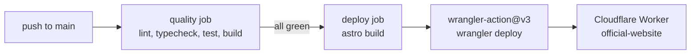

# Deployment Runbook

This site is an Astro 6 application served by a Cloudflare Worker. `astro build` compiles the site into `dist/`, and Wrangler ships that output to Cloudflare. There is no OpenNext in this pipeline. The `@astrojs/cloudflare` adapter targets Workers directly, so there is no intermediate framework build to translate.

[DEPLOY.md](../DEPLOY.md) is the quick reference. This page is the operations view: how the pipeline fits together, where every variable lives, and what to do when a deploy misbehaves.

## Architecture

One build command produces everything Wrangler needs:

1. `astro build` renders the site and writes static assets to `dist/client/`.
2. The same build bundles the server into `dist/server/`, with `entry.mjs` as the Worker entrypoint.
3. The adapter generates `dist/server/wrangler.json`. It merges the settings from the root `wrangler.jsonc` and adds what the Worker needs: the entrypoint, a static asset binding named `ASSETS` pointing at `dist/client/`, a `SESSION` KV namespace for sessions, and an `IMAGES` binding for image processing.
4. A small redirect file, `.wrangler/deploy/config.json`, tells any `wrangler` command run at the repo root to use that generated config instead of the bare root one.

You can see this yourself: `bunx wrangler deploy --dry-run` prints "Using redirected Wrangler configuration" and resolves to `dist/server/wrangler.json`.

Files worth knowing:

| Path | Purpose |
|---|---|
| `astro.config.mjs` | Astro config. Sets `output: 'server'`, registers the Cloudflare adapter (with `platformProxy` enabled for local dev), MDX, sitemap, and Tailwind. |
| `wrangler.jsonc` | Hand-maintained Worker settings: name (`official-website`), compatibility date (`2026-05-21`), `nodejs_compat`, observability enabled. |
| `dist/client/` | Static assets (build output, gitignored). |
| `dist/server/` | Worker bundle plus the generated `wrangler.json` (build output, gitignored). |
| `.wrangler/deploy/config.json` | Redirect that points Wrangler at the generated config (gitignored). |

The full path from commit to production:

## How Deployment Happens

Deployment is automatic. A single workflow, `.github/workflows/ci.yml`, handles CI and CD.

**Triggers:** pull requests targeting `main`, pushes to `main`, and manual `workflow_dispatch`.

**The `quality` job** runs on every trigger: `bun install`, ESLint, `astro check`, `bun test`, and a full `astro build`. This is the gate. Nothing deploys until it passes.

**The `deploy` job** runs only when the event is a push to `refs/heads/main` and `quality` has passed. It checks out the code, installs dependencies, and runs `astro build` again (jobs do not share artifacts, so the production bundle is built fresh). It then calls `cloudflare/wrangler-action@v3` with `command: deploy`, authenticated by two repository secrets:

| Secret | Feeds |
|---|---|
| `CLOUDFLARE_API_TOKEN` | `apiToken` input. Must have Workers edit permission. |
| `CLOUDFLARE_ACCOUNT_ID` | `accountId` input. |

Two details that surprise people:

- Manual `workflow_dispatch` runs execute the `quality` job only. The deploy job's condition requires a push event to `main`, so dispatch is a sanity check, not a deploy button.
- The build runs in both jobs. A green PR check does not mean the artifact deployed; merging is what deploys.

To deploy from your laptop instead, run `bun run deploy` with `CLOUDFLARE_API_TOKEN` and `CLOUDFLARE_ACCOUNT_ID` in your `.env`. Reserve this for intentional releases. The reviewed path is merge to `main`.

## Environment Variables

Three values matter, and none of them are set at the Worker runtime. Everything is either a GitHub setting or a local `.env` entry.

| Variable | Kind | Local builds (`.env`) | CI builds (GitHub) | Worker runtime |
|---|---|---|---|---|
| `CLOUDFLARE_API_TOKEN` | Secret | Required for `bun run deploy` | Action secret, passed to wrangler-action | Not needed |
| `CLOUDFLARE_ACCOUNT_ID` | Secret | Required for `bun run deploy` | Action secret, passed to wrangler-action | Not needed |
| `PUBLIC_CLARITY_TRACKING_ID` | Public, build-time only | `.env` | Repository **variable** (`vars.PUBLIC_CLARITY_TRACKING_ID`) | Not needed, already inlined |

See `.env.example` for all three names with setup comments. Copy it to `.env` and fill in real values; `.env` is gitignored.

### Why the analytics ID is special

`PUBLIC_CLARITY_TRACKING_ID` enables Microsoft Clarity. `src/layouts/Layout.astro` reads it through `import.meta.env.PUBLIC_CLARITY_TRACKING_ID`, and Vite inlines that value into the bundle when the build runs. It is baked in at build time and cannot be changed afterward.

Practical consequences:

- Any environment that runs a build needs the value present: your `.env` locally, the GitHub repository variable in CI. Both build steps in `ci.yml` pass it through.
- Changing the tracking ID requires a rebuild and redeploy. Editing something at runtime does nothing.
- The `PUBLIC_` prefix is the Astro/Vite convention. It replaces the old Next.js `NEXT_PUBLIC_` prefix used before the Astro migration. Same idea, different spelling.

### Runtime secrets

This pipeline configures no Worker runtime secrets or variables. If the site ever needs one, add it with `wrangler secret put`, then document the name and its rotation story here. Never the value itself.

## Local Workflow

All commands come from `package.json`.

| Command | What it runs | When to use it |
|---|---|---|
| `bun run dev` | `astro dev` | Daily work. Dev server at `http://localhost:4321`. With `platformProxy` enabled, Cloudflare bindings work locally through Wrangler's proxy. |
| `bun run start` | `astro dev` | Alias of `dev`. |
| `bun run build` | `astro build` | Produce `dist/`. This is the exact command CI runs. |
| `bun run preview` | `astro build && wrangler pages dev dist` | Full build served through Wrangler's local runtime. The closest thing to production you can run locally. |
| `bun run deploy` | `astro build && wrangler deploy` | Rebuild and ship to production. Intentional acts only. |
| `bun run cf-typegen` | `wrangler types --env-interface CloudflareEnv cloudflare-env.d.ts` | Refresh TypeScript types after a binding change. |

`dev` and `preview` answer different questions. `dev` is fast and reloads as you type, but it is not the Worker runtime. `preview` runs the real built bundle through workerd, so Worker-specific behavior shows up there first.

## Release Checklist

1. On your branch: `bun run lint && bun astro check && bun run test && bun run build`.
2. Optional but wise before a risky change: `bun run preview`, then click around.
3. Open a pull request. The `quality` job runs on it.
4. Merge to `main`. The push reruns `quality`, then `deploy`.
5. Watch the Actions tab. A green deploy job means `wrangler deploy` succeeded.
6. Confirm the site responds: `curl -I https://stbensonimoh.com/`.

## Troubleshooting

### The deploy job did not run

It only runs on a push to `main`. Pull request runs and manual dispatch runs stop at `quality` by design. If you merged and deploy did not start, check that the push actually landed on `main`.

### `wrangler deploy` fails with an auth error

Usually an expired or under-scoped `CLOUDFLARE_API_TOKEN`. The token needs Workers edit permission. Confirm both Cloudflare secrets exist in GitHub repository settings and that `CLOUDFLARE_ACCOUNT_ID` is set: passing it explicitly avoids Wrangler's own account lookup, which fails when the token cannot read account memberships.

### Clarity is missing after a deploy

The tracking ID was absent in the environment that built the bundle. Check the GitHub repository variable for CI builds and your local `.env` for manual ones, fix the value, then rebuild and redeploy. Nothing runtime-side can add it back.

### Build passes but production misbehaves

Reproduce locally with `bun run preview`, which runs the same built Worker through the real runtime. For production-side evidence, use the Worker's logs in the Cloudflare dashboard: observability is enabled in `wrangler.jsonc`.

### Compatibility date warning during preview

`wrangler.jsonc` requests compatibility date `2026-05-21`. If your installed Wrangler is too old to know that date, update the `wrangler` devDependency and rerun. Preview may fall back to an older date, but behavior tied to the newer date will not match production.

### Rolling back a bad deploy

Workers keeps deployment history. Roll back from the Cloudflare dashboard (Worker `official-website`, then Deployments) or with `npx wrangler rollback`. Treat rollback as a stopgap: fix forward through a reviewed PR. Production changes outside the review process are not allowed in this repo.
