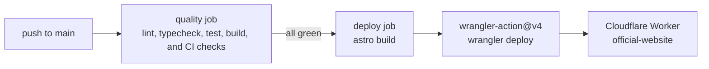

# Deployment Runbook

This site is an Astro 7.2.4 application. The `astro build` command compiles the site into `dist/`. Wrangler ships that output to Cloudflare. The `@astrojs/cloudflare` adapter targets Workers directly. There is no intermediate framework build.

[DEPLOY.md](../DEPLOY.md) is the quick reference. This page is the operations view. It shows how the pipeline fits together, where every variable lives, and what to do when a deploy misbehaves.

## Architecture

One build command produces everything Wrangler needs:

1. The build renders every route and writes the HTML files and static assets to `dist/client/`.
2. The same build bundles the Worker into `dist/server/`. The entrypoint is `entry.mjs`.
3. The adapter generates `dist/server/wrangler.json`. The file merges the settings from the root `wrangler.jsonc` and adds the entrypoint and one static asset binding. The binding is named `ASSETS` and points at `dist/client/`. The build uses no other binding.
4. The file `.wrangler/deploy/config.json` points a `wrangler` command at the generated config.

Run `bunx wrangler deploy --dry-run` to see this. The command prints "Using redirected Wrangler configuration" and resolves to `dist/server/wrangler.json`.

Files worth knowing:

| Path | Purpose |
|---|---|
| `astro.config.mjs` | Astro config. Sets `output: 'server'`, `build.format: 'file'`, the Cloudflare adapter, the MDX and sitemap integrations, Tailwind, and the font families. |
| `wrangler.jsonc` | Hand-maintained Worker settings: name (`official-website`), compatibility date (`2026-05-21`), `nodejs_compat`, observability enabled. |
| `dist/client/` | HTML files, hashed assets, `_headers`, `_redirects`, feeds, and `robots.txt` (build output, gitignored). |
| `dist/server/` | Worker bundle plus the generated `wrangler.json` (build output, gitignored). |
| `.wrangler/deploy/config.json` | Redirect that points Wrangler at the generated config (gitignored). |

The full path from commit to production:

```mermaid
flowchart LR
    A["push to main"] --> B["quality job<br/>lint, typecheck, test, build, and CI checks"]
    B -->|"all green"| C["deploy job<br/>astro build"]
    C --> D["wrangler-action@v4<br/>wrangler deploy"]
    D --> E["Cloudflare Worker<br/>official-website"]
```

## How Deployment Happens

Deployment is automatic. A single workflow, `.github/workflows/ci.yml`, handles CI and CD.

**Triggers:** pull requests that target `main`, pushes to `main`, and manual `workflow_dispatch` runs.

**The `quality` job** runs on every trigger: `bun install`, ESLint, `astro check`, `bun test`, a full `astro build`, Lighthouse CI (`bunx lhci autorun`), the render-blocking third-party check (`scripts/check-render-blocking-third-parties.mjs`), and the single-main landmark check (`scripts/check-single-main.mjs`). This job is the gate. Nothing deploys until it passes.

**The `deploy` job** runs only when the event is a push to `refs/heads/main` and the `quality` job passed. It checks out the code, installs dependencies, and runs `astro build` again. Jobs do not share artifacts, so the production bundle is built fresh. It then calls `cloudflare/wrangler-action@v4` with `command: deploy`. Two repository secrets authenticate the call:

| Secret | Feeds |
|---|---|
| `CLOUDFLARE_API_TOKEN` | `apiToken` input. The token must have Workers edit permission. |
| `CLOUDFLARE_ACCOUNT_ID` | `accountId` input. |

Two details that surprise people:

- Manual `workflow_dispatch` runs execute the `quality` job only. The deploy job condition requires a push event to `main`, so a dispatch is a sanity check, not a deploy button.
- The build runs in both jobs. A green PR check does not mean the artifact deployed. The merge is what deploys.

To deploy from your laptop, run `bun run deploy` with `CLOUDFLARE_API_TOKEN` and `CLOUDFLARE_ACCOUNT_ID` in your `.env`. Reserve this command for intentional releases. The reviewed path is merge to `main`.

## Environment Variables

Three values matter. None of them is set at the Worker runtime. Each value is either a GitHub setting or a local `.env` entry.

| Variable | Kind | Local builds (`.env`) | CI builds (GitHub) | Worker runtime |
|---|---|---|---|---|
| `CLOUDFLARE_API_TOKEN` | Secret | Required for `bun run deploy` | Action secret, passed to wrangler-action | Not needed |
| `CLOUDFLARE_ACCOUNT_ID` | Secret | Required for `bun run deploy` | Action secret, passed to wrangler-action | Not needed |
| `PUBLIC_CLARITY_TRACKING_ID` | Public, build-time only | `.env` | Repository variable (`vars.PUBLIC_CLARITY_TRACKING_ID`) | Not needed, already inlined |

See `.env.example` for all three names with setup comments. Copy the file to `.env`. Fill in the real values. The `.env` file is gitignored. Use the `PUBLIC_` prefix. An old `NEXT_PUBLIC_` entry does nothing.

### Why the analytics ID is special

`PUBLIC_CLARITY_TRACKING_ID` enables Microsoft Clarity. `src/layouts/Layout.astro` reads the value through `import.meta.env.PUBLIC_CLARITY_TRACKING_ID`. Vite inlines that value into the bundle when the build runs. The value is baked in at build time and cannot change afterward.

Practical consequences:

- Any environment that runs a build needs the value: your `.env` locally, and the GitHub repository variable in CI. Both build steps in `ci.yml` pass it through.
- A change to the tracking ID requires a rebuild and a redeploy. A runtime edit does nothing.
- The `PUBLIC_` prefix is the Astro and Vite convention. It replaces the old Next.js `NEXT_PUBLIC_` prefix from before the Astro migration.

### Runtime secrets

This pipeline configures no Worker runtime secrets and no Worker runtime variables. If the site needs a secret later, add it with `wrangler secret put`. Document the name and its rotation story here. Never document the value.

## Local Workflow

All commands come from `package.json`.

| Command | What it runs | When to use it |
|---|---|---|
| `bun run dev` | `astro dev` | Daily work. The dev server listens at `http://localhost:4321`. Cloudflare bindings work locally through the platform proxy. |
| `bun run start` | `astro dev` | Alias of `dev`. |
| `bun run build` | `astro build` | Produce `dist/`. CI runs this exact command. |
| `bun run preview` | `astro build && astro preview` | Serve the built site through the real Workers runtime. |
| `bun run deploy` | `astro build && wrangler deploy` | Rebuild and ship to production. Intentional acts only. |
| `bun run cf-typegen` | `wrangler types --env-interface CloudflareEnv cloudflare-env.d.ts` | Refresh TypeScript types after a binding change. |

The `dev` and `preview` commands answer different questions. The `dev` command reloads as you type, but it does not run the Worker runtime. The `preview` command serves the built bundle through `workerd`, so Worker-specific behavior appears there first.

The `astro preview` command runs in the foreground. Stop it with Ctrl+C. To run it detached, add `--background`. Stop a detached server with `bunx astro preview stop`.

## Release Checklist

1. On your branch, run `bun run lint && bun astro check && bun run test && bun run build`.
2. For a risky change, run `bun run preview` and click around.
3. Open a pull request. The `quality` job runs on it.
4. Merge to `main`. The push reruns `quality`, then runs `deploy`.
5. Watch the Actions tab. A green deploy job means `wrangler deploy` succeeded.
6. Confirm the site responds: `curl -I https://stbensonimoh.com/`.

## Troubleshooting

### The deploy job did not run

The deploy job runs only on a push to `main`. Pull request runs and manual dispatch runs stop at `quality` by design. If you merged and the deploy did not start, check that the push landed on `main`.

### `wrangler deploy` fails with an auth error

The `CLOUDFLARE_API_TOKEN` is usually expired or under-scoped. The token needs Workers edit permission. Confirm that both Cloudflare secrets exist in the GitHub repository settings. Confirm that `CLOUDFLARE_ACCOUNT_ID` is set. An explicit account ID avoids Wrangler's own account lookup, which fails when the token cannot read account memberships.

### The build fails with a font download error

The build downloads font files from Google through the Astro Fonts API. The build environment needs network access. Restore network access, then rebuild.

### Clarity is missing after a deploy

The tracking ID was absent in the environment that built the bundle. Check the GitHub repository variable for CI builds and your `.env` for manual builds. Correct the value, then rebuild and redeploy. Nothing at runtime can add the value back.

### Build passes but production misbehaves

Reproduce locally with `bun run preview`. That command runs the same built Worker through the real runtime. For production-side evidence, use the Worker logs in the Cloudflare dashboard. Observability is enabled in `wrangler.jsonc`.

### Compatibility date warning during preview

`wrangler.jsonc` requests compatibility date `2026-05-21`. If your installed Wrangler is too old for that date, update the `wrangler` devDependency and rerun. Preview can fall back to an older date, but behavior tied to the newer date does not match production.

### Rolling back a bad deploy

Workers keeps deployment history. Roll back from the Cloudflare dashboard (Worker `official-website`, then Deployments) or with `npx wrangler rollback`. Treat a rollback as a stopgap. Fix forward through a reviewed PR. This repo does not allow production changes outside the review process.

The HTML uses `public, max-age=0, must-revalidate`, so a rollback takes effect on the next request. Purge only the cached asset paths (`/images/*`, `/robots.txt`, `/favicon.svg`, `/favicon.ico`, `/favicon-32.png`, `/apple-touch-icon.png`) if they changed.
